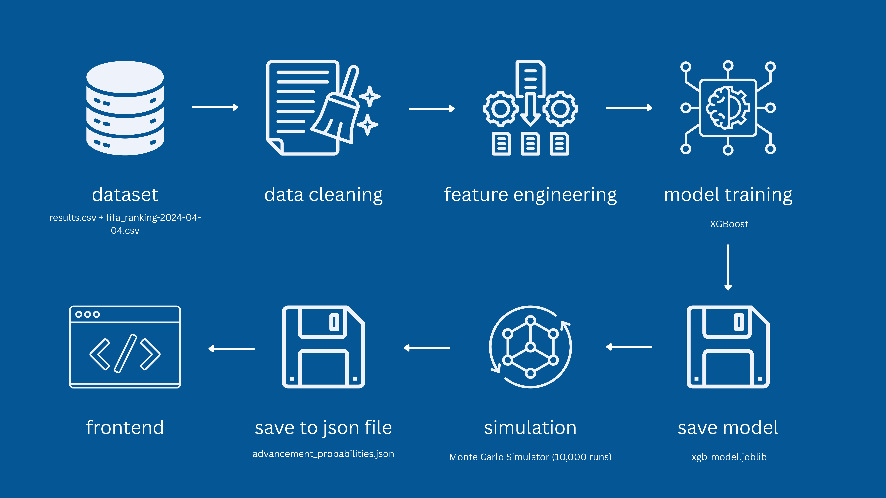
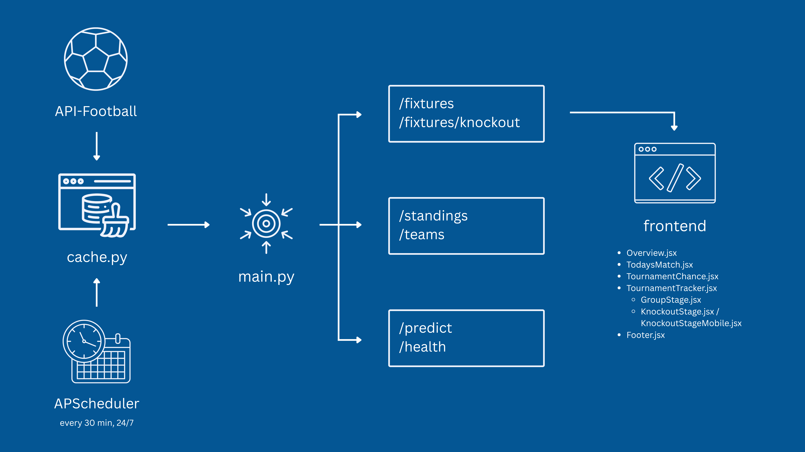

# World Cup 2026 AI Prediction

A World Cup 2026 prediction that uses XGBoost model and runs 10,000 Monte Carlo simulations across the entire 104-match tournament, estimating each team's possibility of reaching every stage, from the Round of 32 to becoming the winner.

Live demo: https://world-cup-2026-ai-prediction.vercel.app/

---

## Features

- Match outcome prediction using XGBoost trained on historical results and FIFA rankings
- 10,000 Monte Carlo simulations across the entire 48-team bracket, covering all 104 matches from group stage to final
- Per-match win probability bar (home / draw / away) for upcoming matches
- Win probability breakdown per team at every stage, sortable by round
- Live scores, fixtures, and updated group standings and knockout brackets via API-Football
- Date picker to browse fixtures across the tournament window

---

## Tech Stack

| Layer | Technology |
|---|---|
| Language | Python |
| ML model | XGBoost, scikit-learn, pandas, numpy |
| Backend | FastAPI, APScheduler |
| Frontend | React, Tailwind CSS, react-calendar, Lucide React, react-icons |
| Live data | API-Football |
| Flags | FlagCDN |
| Deployment | Render (backend), Cron Job (cold start prevention), Vercel (frontend) |

---

## Architecture

The project is split into two parts: a **training phase** that processes historical data, builds the model, and runs the pre-tournament simulation, and a **backend** that serves live fixture data and match predictions to the React frontend.

### Training Pipeline



### System Architecture



---

### Dataset

- International match results (`results.csv`) — [Kaggle](https://www.kaggle.com/datasets/martj42/international-football-results-from-1872-to-2017)
- FIFA world rankings (`fifa_ranking-2024-04-04.csv`) — [Kaggle](https://www.kaggle.com/datasets/parasharmanas/predicting-copa-america-2024-using-ml)

> **Note:** `fifa_ranking-2024-04-04.csv` was sourced from a Copa América 2024 ML dataset on Kaggle but contains historical FIFA world rankings up to April 2024.

**Preprocessing:**
- Filter results to post-2010 competitive matches
- Filter to: FIFA World Cup, UEFA Euro, Copa América, AFCON, AFC Asian Cup, CONCACAF Nations League, UEFA Nations League, AFF Championship (+ qualifiers)
- Fix team name mismatches between datasets
- Use `merge_asof` to link the closest preceding FIFA rankings for both home and away sides

---

### Features

| Feature | Description |
|---|---|
| `neutral` | Whether the match is at a neutral venue (0/1) |
| `tournament_encode` | Label-encoded tournament type |
| `h2h_home_win` | Previous head-to-head wins for the home team |
| `h2h_away_win` | Previous head-to-head wins for the away team |
| `h2h_draw` | Previous head-to-head draws |
| `home_form` | Win rate from home team's last 5 matches |
| `away_form` | Win rate from away team's last 5 matches |
| `home_rank` | FIFA rank of home team at match date |
| `away_rank` | FIFA rank of away team at match date |
| `rank_difference` | `home_rank - away_rank` |

H2H records and recent form are precomputed at startup in `predictor.py` for all 48 World Cup teams to avoid recomputing on every prediction request.

---

### Model

Three classifiers were trained and compared on an 80/20 train-test split:

| Model | Notes |
|---|---|
| Logistic Regression | Baseline; assumes linear feature-outcome relationships |
| Random Forest | Ensemble of independent decision trees |
| XGBoost | Sequential boosting; selected as final model |

XGBoost was picked because it is designed to handle complex, tabular data that has mixed feature types. It handles non-linear relationships and feature interactions without manual engineering. The model is saved to `models/xgb_model.joblib` and loaded at startup in `predictor.py`.

---

### Monte Carlo Simulation

Since each match has uncertainty, a single tournament simulation would be unreliable. Instead, Monte Carlo was used to simulate the entire tournament 10,000 times. XGBoost doesn't predict who wins — it predicts probabilities. Through its win probabilities and a bit of randomness, the simulation allows unexpected results to happen.

**Each run:**
1. Simulates all group stage matches — outcomes sampled from XGBoost probabilities via `np.random.choice`
2. Ranks group standings and selects top 2 per group + best 8 third-place teams (32 teams total)
3. Runs knockout rounds: Round of 32 → Round of 16 → Quarter-final → Semi-final → Final

Knockout matches are not allowed to have draws. The draw probability is redistributed proportionally before sampling:

```python
home_prob = result['home_win'] + result['draw'] / 2
away_prob = result['away_win'] + result['draw'] / 2
```

This ensures the simulation respects tournament rules (no draws in knockouts) while preserving XGBoost's uncertainty. Note: Live fixtures served via `/fixtures` endpoint still show draw probabilities for all rounds, including knockouts. This reflects raw model output, not tournament rules.

Output is written to `frontend/src/data/advancement_probabilities.json` and imported statically by the frontend:

```json
{
  "France": { "R32": 92.49, "R16": 70.82, "QF": 46.22, "SF": 32.74, "Final": 22.58, "Champion": 15.30 },
  "Spain":  { "R32": 95.68, "R16": 65.34, "QF": 43.93, "SF": 31.22, "Final": 18.65, "Champion": 11.49 }
}
```

---

### Backend

FastAPI app (`main.py`) with the following endpoints:

| Endpoint | Description |
|---|---|
| `GET /predict?home_team=&away_team=` | Returns XGBoost win probabilities for a matchup |
| `GET /fixtures?date=&timezone=` | Returns fixtures for a given date; includes win probabilities for upcoming matches only |
| `GET /fixtures/knockout` | Returns knockout stage fixtures in proper bracket order; inferred matchups displayed immediately when both teams confirmed, replaced with API data on arrival |
| `GET /standings` | Returns live group standings |
| `GET /teams` | Returns team name → logo URL mapping |
| `GET /health` | Health check |

**Caching & polling:** Fixtures and standings are fetched from API-Football at startup and cached in memory. APScheduler polls for fixture updates every 30 minutes. Standings are only refreshed when a fixture status transitions to `FT` or `PEN` (penalty shootout) — not on every poll.

**Team name mapping:** `mapper.py` maps API-Football team names to match the model's training data (e.g. `Türkiye` → `Turkey`, `Congo DR` → `DR Congo`, `Cape Verde Islands` → `Cape Verde`).

**CORS** is configured for `localhost:5173` (dev) and `https://world-cup-2026-ai-prediction.vercel.app` (production).

#### Knockout Bracket Ordering

The `/fixtures/knockout` endpoint returns matches in proper bracket order, not API chronological order. This is handled by `knockout_rounds.py`:

**Round of 32:** The 48-team format creates a fixed bracket structure determined by tournament rules: Groups A–L are mapped to specific R32 slots. Slot 1 = Group E winner vs best 3rd-place finisher, Slot 2 = Group I winner vs best 3rd from another group, etc. R32 matches are fetched from the API and reordered to align with this hardcoded structure using Group winners/runners-up as anchors.

**Round of 16 through Final:** Bracket slots are dynamically built from previous round winners. When an R32 match finishes (status `FT`, `AET`, or `PEN`), the winner is extracted and paired with the winner from the adjacent R32 slot, forming an R16 matchup. Same logic cascades through QF → SF → Final.

**Match inference:** API-Football often lags in creating new-round fixtures (sometimes 10+ hours after the previous round concludes). To provide immediate feedback, when both teams in a bracket slot are confirmed winners, the backend infers the matchup and displays it with extracted team flags (`home_logo`, `away_logo` pulled from the feeder matches). Once the API creates the official match object, it replaces the inferred version on the next poll.

**Third place:** Extracted from SF losers using the same winner/loser extraction logic, displayed with or without inferred team names depending on SF completion.

---

### Frontend

Single-page React app with four sections:

| Component | Description |
|---|---|
| `Footer.jsx` | Footer with social links (LinkedIn, GitHub, Portfolio) |
| `GroupStage.jsx` | Live group standings fetched from `/standings`, navigable by group A–L |
| `KnockoutStage.jsx` | Desktop bracket view with connector lines drawn in CSS |
| `KnockoutStageMobile.jsx` | Mobile bracket view with a tab per round and horizontal slide animation |
| `NavBar.jsx` | Top navigation with anchor links to each section |
| `Overview.jsx` | Hero section showing the predicted champion and pre-tournament simulation rankings sorted by champion probability |
| `TodaysMatch.jsx` | Date picker (Jun 11 – Jul 20) with fixtures for the selected date; shows win probability bars for upcoming matches and final score for completed ones |
| `TournamentChance.jsx` | Sortable table of all 48 teams × 6 stages with advancement probabilities, loaded from the static JSON |
| `TournamentTracker.jsx` | Tab switcher between group standings and knockout bracket |

`fetchWithRetry.js` retries up to 4 times with a 20-second delay on 503 responses, handling Render's free-tier cold-start delay.

---

## Project Structure

```
├── images/
│   ├── system-architecture.png
│   └── training-pipeline.png
├── data/
│   ├── fifa_ranking-2024-04-04.csv   # FIFA world rankings (1992–2024)
│   └── results.csv                   # International match results (1872–2026)
├── models/
│   └── xgb_model.joblib              # Trained XGBoost model
├── frontend/
│   ├── public/
│   │   ├── favicon.png
│   │   └── icons.svg
│   ├── src/
│   │   ├── components/
│   │   │   ├── Footer.jsx
│   │   │   ├── GroupStage.jsx
│   │   │   ├── KnockoutStage.jsx
│   │   │   ├── KnockoutStageMobile.jsx
│   │   │   ├── NavBar.jsx
│   │   │   ├── Overview.jsx
│   │   │   ├── TodaysMatch.jsx
│   │   │   ├── TournamentChance.jsx
│   │   │   └── TournamentTracker.jsx
│   │   ├── data/
│   │   │   ├── abbreviations.js
│   │   │   └── advancement_probabilities.json
│   │   ├── utils/
│   │   │   └── fetchWithRetry.js
│   │   ├── App.jsx
│   │   ├── index.css
│   │   └── main.jsx
│   ├── index.html
│   ├── package.json
│   └── vite.config.js
├── exploration.ipynb                 # Full pipeline: EDA → training → simulation
├── api_football.py                   # API-Football client
├── cache.py                          # In-memory fixture/standings cache
├── knockout_rounds.py                # Knockout bracket ordering and match inference
├── main.py                           # FastAPI app and API endpoints
├── mapper.py                         # Team name normalization (API → model)
├── predictor.py                      # Model loading, feature computation, prediction
├── world_cup_teams.py                # Group draw and FIFA rankings lookup
├── requirements.txt
└── LICENSE
```

---

## Getting Started

### Prerequisites

- Python 3.10+
- Node.js 18+
- API-Football API key ([api-sports.io](https://api-sports.io))

### Backend

```bash
# Install dependencies
pip install -r requirements.txt

# Add your API key
echo "API_FOOTBALL_KEY=your_key_here" > .env

# Run the training pipeline
# Open exploration.ipynb in VS Code and run all cells
# This generates models/xgb_model.joblib and frontend/src/data/advancement_probabilities.json

# Start the API server
uvicorn main:app --reload
```

### Frontend

```bash
cd frontend
npm install

# Set backend URL
echo "VITE_API_URL=http://localhost:8000" > .env

npm run dev
```

---

## Limitations

- API-Football lags in creating new-round fixtures after previous round conclusions (typically 30 min to 10+ hours). Inferred matches (based on confirmed winners) appear immediately but lack official API data until the delay resolves
- Render free tier causes cold-start delays on the first request; the frontend retries with a 20-second backoff to compensate

---

## License

MIT
